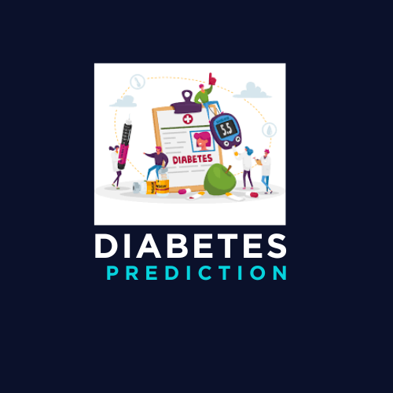
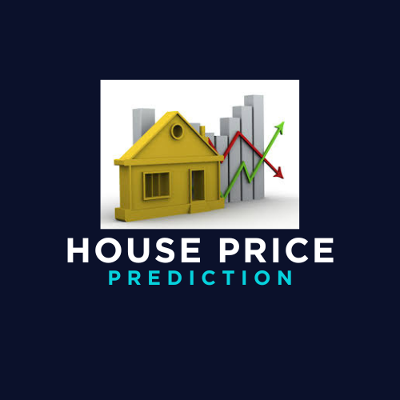

<!--
**rayyan-merchant/rayyan-merchant** is a ✨ _special_ ✨ repository because its `README.md` (this file) appears on your GitHub profile.

Here are some ideas to get you started:

- 🔭 I’m currently working on ...
- 🌱 I’m currently learning ...
- 👯 I’m looking to collaborate on ...
- 🤔 I’m looking for help with ...
- 💬 Ask me about ...
- 📫 How to reach me: ...
- 😄 Pronouns: ...
- ⚡ Fun fact: ...
-->
<!--
    Hey there, I'm Rayyan Merchant!
    Thanks for exploring my GitHub profile.
    Feel free to connect and collaborate!
-->

<!--
    Hey there, I'm Rayyan Merchant!
    Welcome to my GitHub profile.
    Feel free to connect, explore, and collaborate!
-->

---

Here’s a creative and motivational “About Me” section tailored for your GitHub profile:

---

### 🌟 About Me  

Hey there! 👋 I’m **Rayyan Merchant**, a tech enthusiast on a relentless quest to turn ideas into impactful solutions. 🚀  

I believe that **technology isn’t just a tool**—it’s a canvas for creativity and innovation. My passion lies in building intelligent systems that bridge the gap between imagination and reality. Whether it’s solving real-world problems with **AI and Machine Learning** or exploring the unknown with **code**, I’m always ready to dive into the next big challenge. 🌌  

Here’s what fuels my journey:  
- 🧠 **Lifelong Learner**: Every day is an opportunity to grow, to experiment, and to create. I thrive on challenges that push boundaries.  
- 🌱 **Explorer of Ideas**: From crafting predictive models to unraveling the secrets of data, I’m on a mission to make sense of the complex.  
- 💡 **Problem Solver**: For me, every problem is a puzzle waiting to be solved, and every solution is a step toward making the world smarter and better.

📖 *"Dream big, start small, but most of all, start."*  

Let’s connect, share ideas, and build something amazing together! 🤝  

---

### 🛠️ Skills  

#### Programming Languages  
  
  
  

#### Frameworks and Libraries  
  
  
  
  
  

#### Tools  
  
  

---
### 💻 Projects  

    <table>
        <tr>
            <td align="center" style="border: none;">
                
                <h3>Diabetes Prediction System</h3>
                
            </td>
            <td align="center" style="border: none;">
                
                <h3>House Price Prediction</h3>
                
            </td>
        </tr>
        <tr>
            <td align="center" style="border: none;">
                
                <h3>Healthcare App</h3>
                
            </td>
            <td align="center" style="border: none;">
                
                <h3>Movie Recommendation System</h3>
                
            </td>
        </tr>
    </table>

---

### 🔄 Learning  
- **NLP (Natural Language Processing)**  
- **Agentic AI**  
- **R Programming**
- **Tensor Flow**
- **PyTorch**

---

### 📢 Connect with Me  

    <a href="https://www.linkedin.com/in/rayyanmerchant2004/">
        
    
    

---

### 📄 Resume  
> [!IMPORTANT]  
> <a href="https://drive.google.com/drive/folders/your-resume-link-here" download>Download my resume</a>

**⚡ Fun Fact**: I believe in *“failing forward”*—every setback is just a plot twist in the story of success. 🌟  

✨ Let’s create a smarter, more connected future, one line of code at a time. 💻
