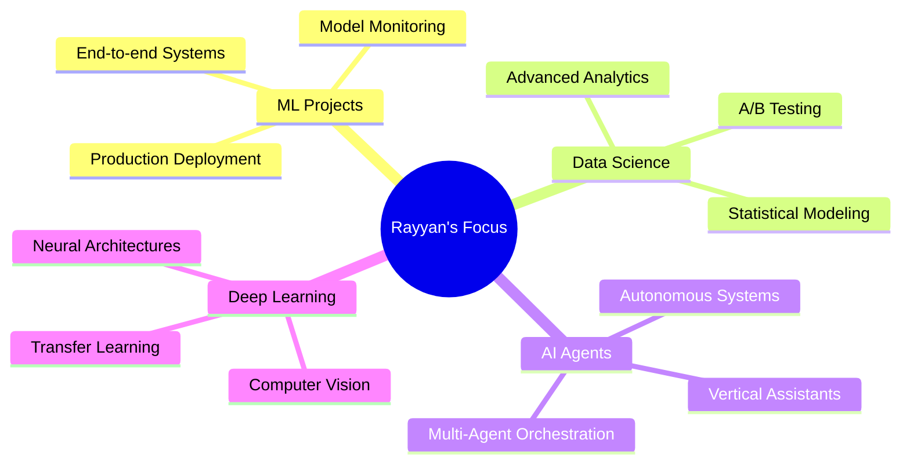

<div align="center">


### 🚀 Data Scientist • ML Engineer • AI Systems Developer

<p>
  
</p>

<p>
  
  
  
  
</p>

</div>

---

<div align="center">

## 🎯 **About Me**

</div>

```python
class DataScientist:
    def __init__(self):
        self.name = "Rayyan Merchant"
        self.role = "Data Scientist & AI Engineer"
        self.location = "Building the Future with Data"
        
    def say_hi(self):
        print("Thanks for dropping by! Let's build something amazing together.")
        
    def get_expertise(self):
        return {
            "data_science": ["EDA", "Statistical Modeling", "BI", "Data Storytelling"],
            "machine_learning": ["Forecasting", "Classification", "NLP", "Recommenders"],
            "ai_systems": ["Multi-Agent", "RAG", "Knowledge Graphs", "Reasoning"],
            "data_engineering": ["ETL", "Data Warehousing", "Dimensional Modeling"]
        }

me = DataScientist()
me.say_hi()
```

<div align="center">

### 💡 I transform raw data and complex business problems into **production-ready systems**, **actionable insights**, and **intelligent solutions**

</div>

---

<div align="center">

## 🏆 **Featured Projects**

</div>

<table>
<tr>
<td width="50%" valign="top">

### 🛍️ Fashion E-Commerce ML System
**End-to-end ML platform for e-commerce intelligence**


**✨ Highlights:**
- 🎯 Hybrid recommender system
- 📊 NLP sentiment analysis
- 📈 Time Series demand forecasting
- 👥 Customer segmentation
- 🔄 ETL data pipelines

**Role:** Team Lead  
**Timeline:** Aug - Dec 2025

[**🔗 View Project →**](https://github.com/Srijaali/ml-based_Fashion-Ecommerce/tree/main/database)

</td>
<td width="50%" valign="top">

### 🧠 LifeMirror — AI Perception Engine
**Multi-agent AI for appearance analysis**


**✨ Highlights:**
- 👁️ YOLO vision models
- 🤖 LangGraph orchestration
- 🔍 pgVector semantic search
- 📁 MinIO media storage
- ⚡ Celery async processing

**Status:** Side Project  
**Timeline:** March 2025 - Ongoing

[**🔗 View Project →**](https://github.com/rayyan-merchant/life-mirror)

</td>
</tr>

<tr>
<td width="50%" valign="top">

### 💬 Companion — Mental Health Reasoner
**Knowledge graph-based chatbot with explainable reasoning**


  
**✨ Highlights:**
- 🧬 Custom OWL ontology
- ⚙️ SWRL rule-based reasoning
- 🔍 SPARQL semantic queries
- 🎯 Causal explainability
- 🚨 Risk detection system

**Role:** Team Lead  
**Timeline:** Oct - Nov 2025

[**🔗 View Project →**](https://github.com/rayyan-merchant/Companion-MentalHealth)

</td>
<td width="50%" valign="top">

### 🗄️ SQL Data Warehouse Platform
**Enterprise data warehouse with dimensional modeling**


**✨ Highlights:**
- 🏗️ Star schema design
- 🔄 ETL pipelines
- ⚡ Query optimization
- 📊 Analytics layer
- 🔐 Data governance

**Skills:** Dimensional Modeling  
**Timeline:** 2025

[**🔗 View Project →**](https://github.com/rayyan-merchant/SQL-DWH-Project)

</td>
</tr>

<tr>
<td width="50%" valign="top">

### 📊 Data Analytics Portfolio
**Business-oriented analysis & visualization projects**


**✨ Highlights:**
- 📈 Exploratory data analysis
- 📊 Statistical modeling
- 🎨 Data visualization
- 💼 Business intelligence
- 📖 Data storytelling

**Focus:** EDA & Insights  

[**🔗 View Project →**](https://github.com/rayyan-merchant/Data-Analytics-Portfolio)

</td>
<td width="50%" valign="top">

### 🗂️ Prodigy — Full-Stack Productivity Tool
**Modern productivity app with task management, timers, and analytics**


**✨ Highlights:**
- ✅ **Task Management**: Create, organize, and track tasks with priorities and deadlines
- ⏱️ **Time Tracking**: Pomodoro timer and productivity session tracking
- 📝 **Notes & Ideas**: Quick capture and organization of thoughts and information
- 📊 **Analytics Dashboard**: Visualize productivity patterns and completion rates
- 🔐 **User Authentication**: Secure Firebase auth with multi-user support
- ☁️ **Cloud Sync**: Real-time data synchronization across devices
  
**Context:** Fundamentals of Software Engineering Course Project  

[**🔗 View Project →**](https://github.com/rayyan-merchant/Prodigy-Productivity-Tool)
)

</td>
</tr>
</table>

---

<div align="center">

## 🛠️ **Technical Arsenal**

</div>

<details open>
<summary><b>📊 Data Science & Analytics</b></summary>
<br>

<p align="center">
  
  
  
  
  
  
  
  
  
</p>

<p align="center">
  <b>Skills:</b> Exploratory Data Analysis • Statistical Modeling • Data Visualization • Feature Engineering • Business Intelligence • Data Storytelling
</p>

</details>

<details open>
<summary><b>🤖 Machine Learning & AI</b></summary>
<br>

<p align="center">
  
  
  
  
  
  
  
</p>

<p align="center">
  <b>Skills:</b> Classification • Regression • Clustering • NLP • Recommender Systems • Time Series Forecasting • Model Evaluation • Hyperparameter Tuning
</p>

</details>

<details open>
<summary><b>🧠 AI Systems & Agents</b></summary>
<br>

<p align="center">
  
  
  
  
</p>

<p align="center">
  <b>Skills:</b> Multi-Agent Systems • Retrieval-Augmented Generation • Vector Databases • Semantic Search • Knowledge Graphs • Reasoning Engines
</p>

</details>

<details open>
<summary><b>🗄️ Databases & Data Engineering</b></summary>
<br>

<p align="center">
  
  
  
  
  
  
  
</p>

<p align="center">
  <b>Skills:</b> Data Warehousing • Dimensional Modeling • ETL Pipelines • Query Optimization • Database Design
</p>

</details>

<details open>
<summary><b>⚙️ Backend & Infrastructure</b></summary>
<br>

<p align="center">
  
  
  
  
  
  
  
</p>

<p align="center">
  <b>Skills:</b> REST APIs • Async Processing • Containerization • Version Control
</p>

</details>

---

<div align="center">

## 🎯 **Current Focus**

</div>



---

<div align="center">

## 📊 **GitHub Analytics**


</div>

---

<div align="center">

## 📄 **Resume**

<a href="https://docs.google.com/document/d/1QRO9eHY34QbT-WV2sDyXYKi1uEnZ8r2E/view" target="_blank">
  
</a>
<a href="https://docs.google.com/document/d/1QRO9eHY34QbT-WV2sDyXYKi1uEnZ8r2E/export?format=pdf" target="_blank">
  
</a>

</div>

---

<div align="center">

## 🤝 **Let's Connect & Collaborate**

<p>
  <a href="https://www.linkedin.com/in/rayyanmerchant2004/">
    
  </a>
  <a href="mailto:merchantrayyan43@gmail.com">
    
  </a>
  <a href="https://github.com/rayyan-merchant">
    
  </a>
</p>

### 💬 **Open to collaborating on:**
Data Science Projects • ML Systems • AI Agents • Open Source Contributions


</div>

---

<div align="center">

**"Data is the new oil, but insights are the refined fuel that drives innovation"** 🚀


</div>
